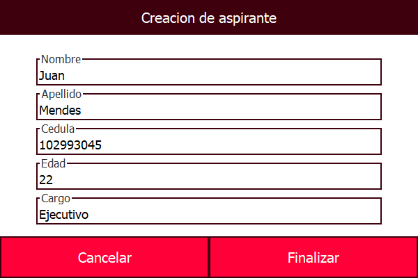
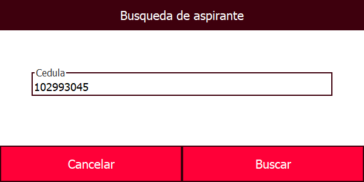

# Human Resources
Workshop that consists of creating an application in which the CRUD is programmed for a human resources company that is being able to manage the information of applicants for positions in the company.

## Program functionality

1. The program has a main home page with which the basic operations of the program can be performed (Exit the program, create applicant, modify applicant, etc.).

2. The creation of the applicant consists of name, last name, ID, age and position. The program is also able to know when the information is biased (such as an ID or age with a letter). 

3. Thanks to the simplicity of the program, the modification, elimination or search of the applicant only requires the applicant's ID card. 

4. To consult the information of all the applicants there is a specific part where the applicant's information (name, last name, ID, etc.) is displayed, called the list. Also, in case you do not have the applicant's ID to perform "x" action, you can copy it directly from the list.

